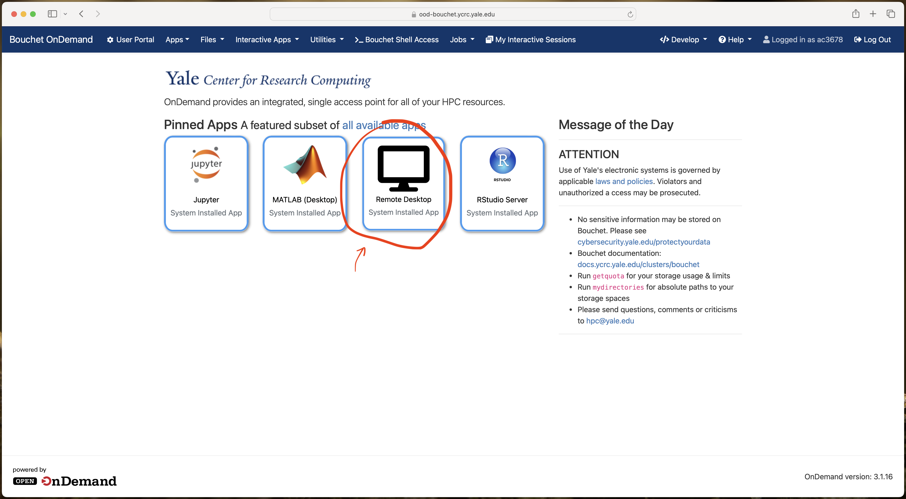
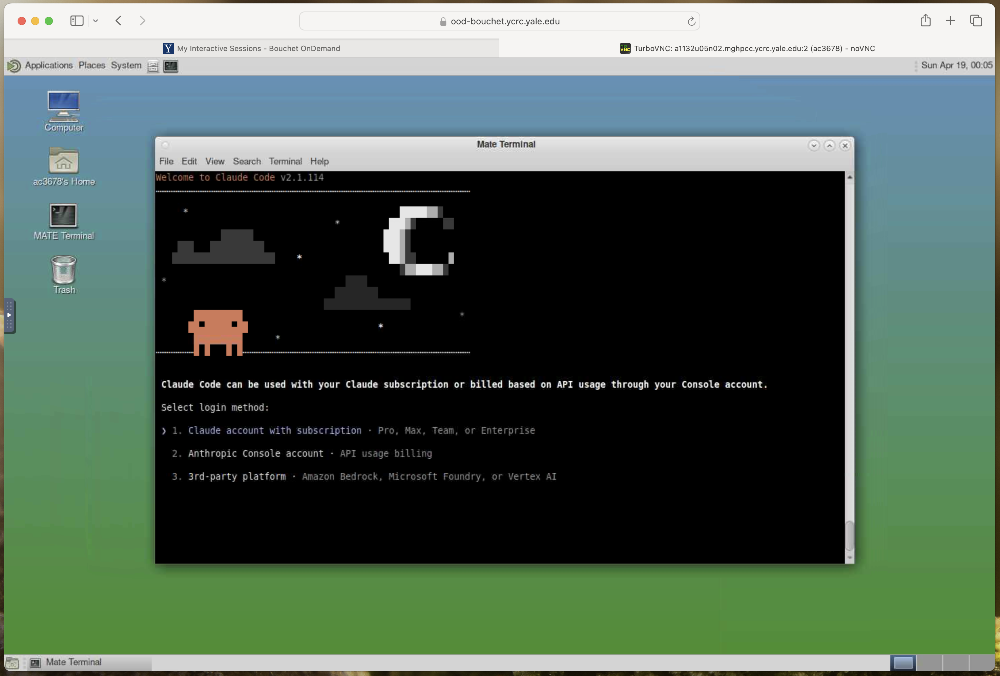
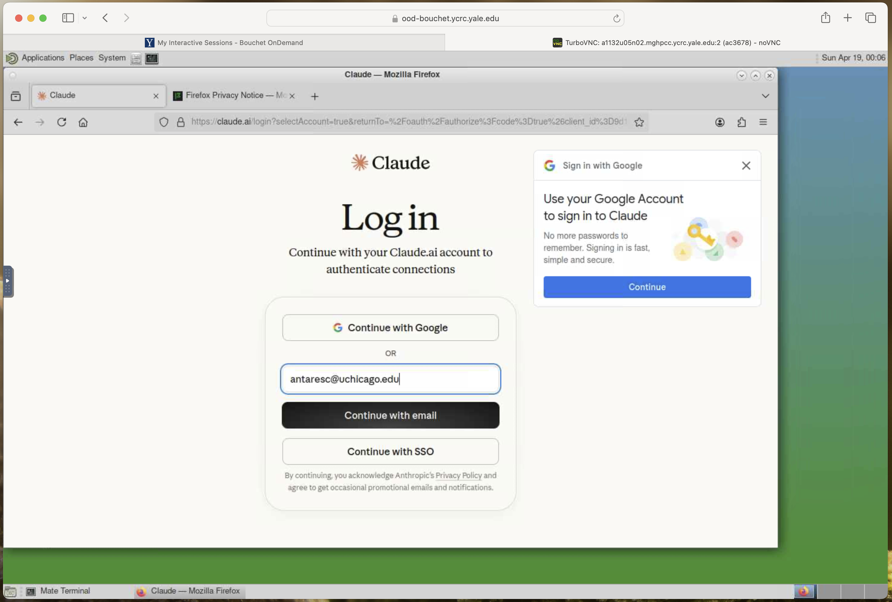
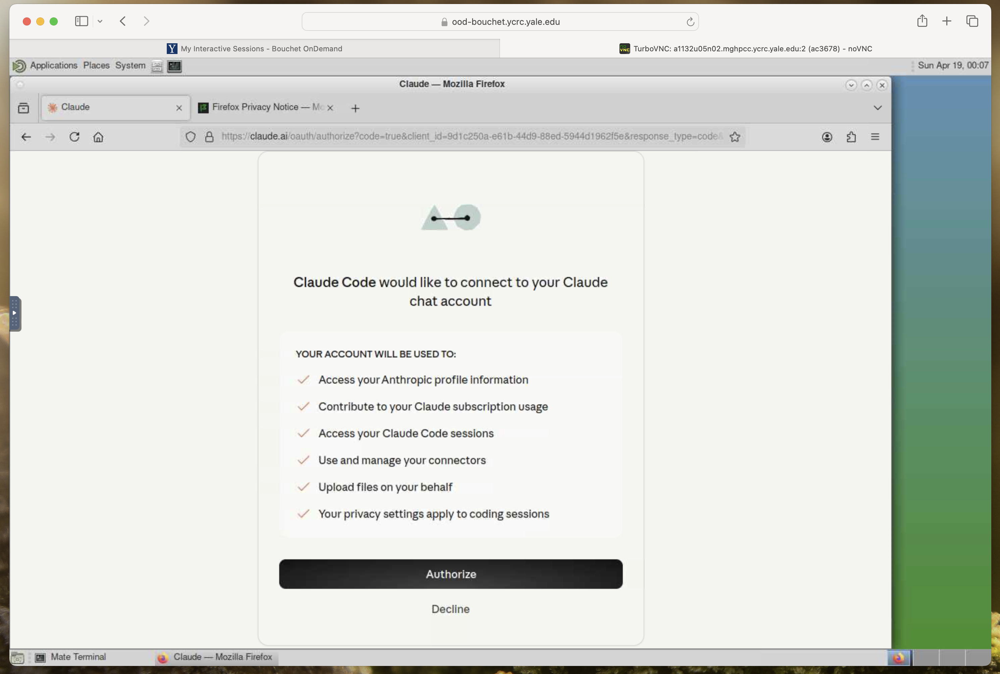
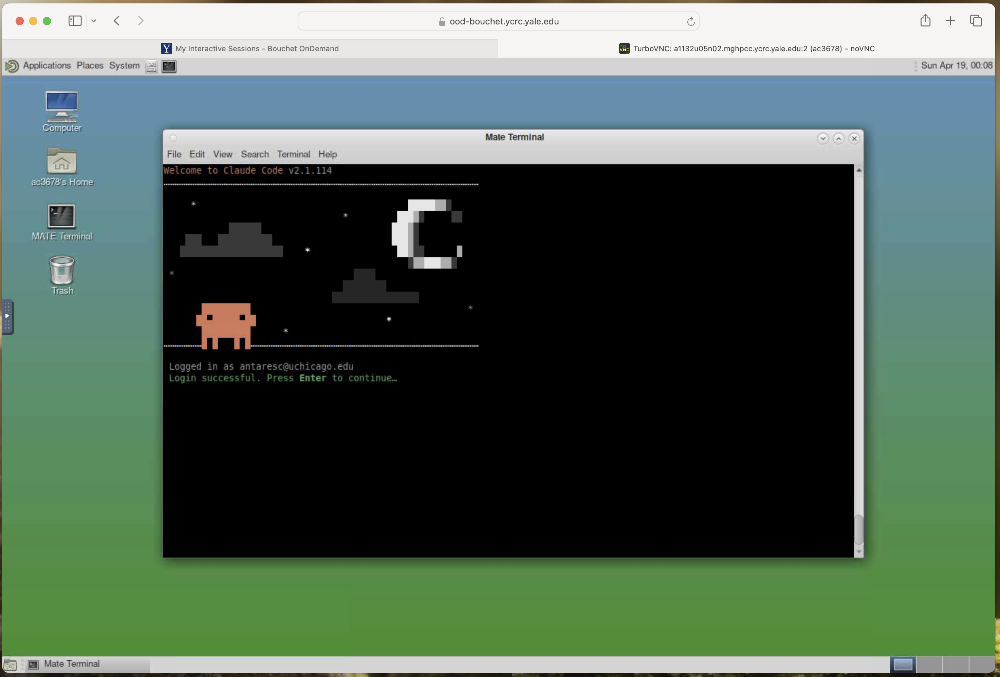
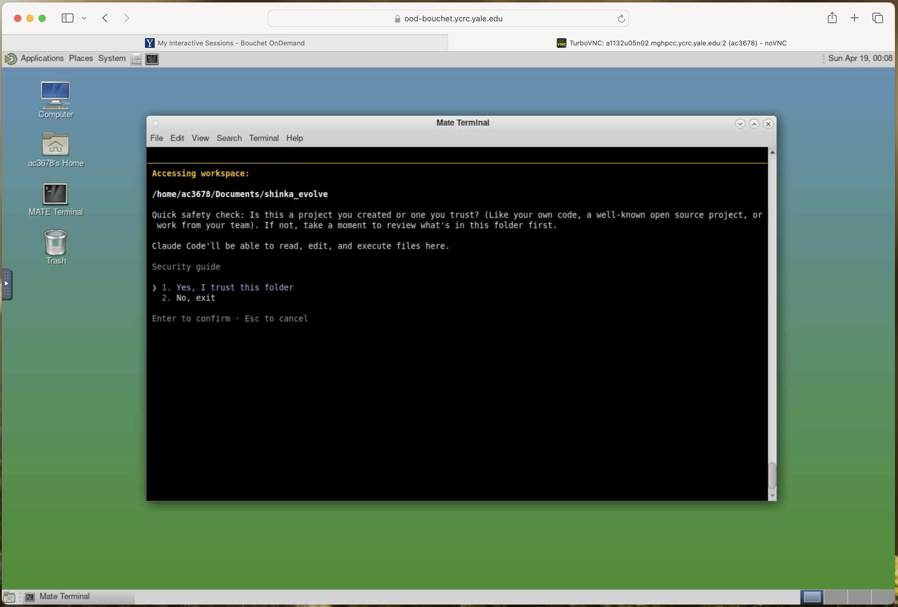
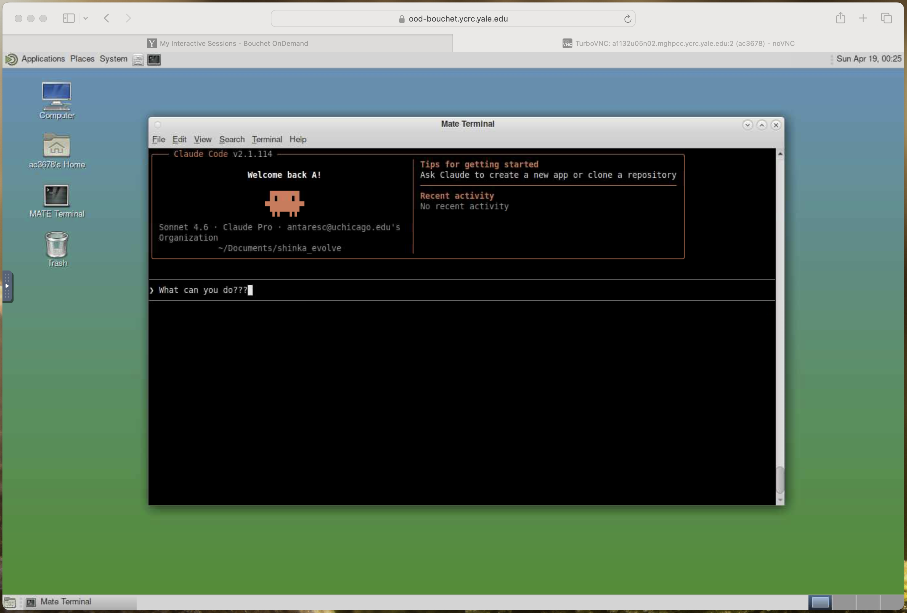

# Claude Code

This guide will discuss [Claude Code](https://www.anthropic.com/product/claude-code), an **agentic coding tool** that can be used in your local programming environment through a terminal or IDE. It is an AI-powered development assistent that can *autonomously* plan and execute multi-step programming tasks. What makes it *agentic* is the fact that it acts in a loop. Through a chat interface, the developer uses *natural language* to prompt Claude Code with questions, or assign development tasks. Claude code then performs appropriate actions to either answer the prompt or execute the task. Feedback is then provided to the user through the same chat interface.

This tutorial is split into two steps

-   Step 1 - how to **install Claude code**

-   Step 2 - how to **setup Claude code** for first time use

Some links that might help with this tutorial

-   [[link](https://code.claude.com/docs/en/overview)] The official Claude code documentation overview

-   [[link](https://code.claude.com/docs/en/quickstart)] The official Claude Code quickstart guide

-   [[link](https://docs.ycrc.yale.edu/clusters/bouchet/)] YCRC's Bouchet HPC cluster overview guide.

Before beginning **make sure you have the following**

-   A **Claude account** with a **Claude Pro, Max, Team or Enterprise subscription**. Yale FDS will have gifted you a Claude Pro subscription if you did not have one prior to this event!

-   If you are using the Bouchet HPC cluster, make sure you have your **Yale NetID** and **password**


## Step 1: Installing Claude Code

How you install Claude Code will depend on what system you are working on. This part of the tutorial is split between three environments.

-   Mac / Linux

-   Windows

-   Yale's Bouchet HPC cluster


### On Mac / Linux

If you are using a Mac / Linux, navigate to your terminal, and run the following command

```bash
curl -fsSL https://claude.ai/install.sh | bash
```

This will download and run the **native installation package** for Claude Code.


##### Alternative Route - Mac if you're using homebrew

[Homebrew](https://brew.sh/) is a widely used package manager for macOS. If you prefer to install Claude Code through homebrew, then use this command

```bash
brew install --cask claude-code
```

This replaces the `curl` command used to download the native installation package.


### On Windows

**TODO(antaresc) - Complete**


### On Bouchet

Use these steps to get started using Bouchet.

1.  Navigate to YCRC's **[Open OnDemand](https://ood-bouchet.ycrc.yale.edu/)** page and click **remote desktop**.

    

2.  You will be brought to a page for requesting a *compute node*. YCRC has provisioned every registered attendee with priority access to nodes on Bouchet.

    - Select your *number of hours* to be `1`.
    - Select your *number of CPU cores per node* to be `4`
    - Select your *memory per CPU code* to be `10`
    - Select your *partition* to be `devel` **This is important (!)**

    **TODO(antaresc) - Make sure that this is the correct amount of compute provisioned to every registered attendee**

3.  Click `Launch` and wait briefly until the compute node is provisioned. Once the node is provisioned, click `Launch Remote Desktop`. *If the wait takes particularly long, please flag down an event organizer*

4.  Upon opening, your remote desktop will have a terminal window active. Run the following command

    ```bash
    curl -fsSL https://claude.ai/install.sh | bash
    ```

    to download and run the **native installation package** for Claude Code.


## Step 2: Using Claude Code for the first time

Before getting started, **navigate to your working directory**. This is the directory containing code you would like to write / ShinkaEvolve experiments you would like to run

```bash
cd path/to/working_directory/
```

For security purposes, Claude Code *can only access contents* in the directory tree rooted at the path you start Claude Code in. To start Claude Code, run this command inside your working directory

```bash
claude
```

Since this will be your first time opening Claude Code, some setup is required. First, **authenticate with your Anthropic account**

-   Select `Claude account with subscription`.

    

This will bring you to a website. **Login to your anthropic account** with a Claude Pro, Max, Team or Enterprise subscription. If you did not have a subscription prior to the event, Anthropic will have emailed you a link with a gifted Claude Pro subscription.



You will be asked connect Claude Code to your Claude Chat account. **Click `accept`**



Once you've successfully logged in, you may close the browser window and verify in your terminal that you've been properly authenticated. Your terminal should say `Login successful`



If you are starting for the first time, Claude Code will ask permissions to access your work space. **Select `Yes, I trust this folder`**



And now you are ready to get started!




## Where to go from here

Now that you have Claude Code enabled on your system, try using some of Claude Code's agentic coding capabilities.

-   Read [Using ShinkaEvolve Agentically](./shinka_agentic.md) to see how to use ShinkaEvolve through Claude Code.
