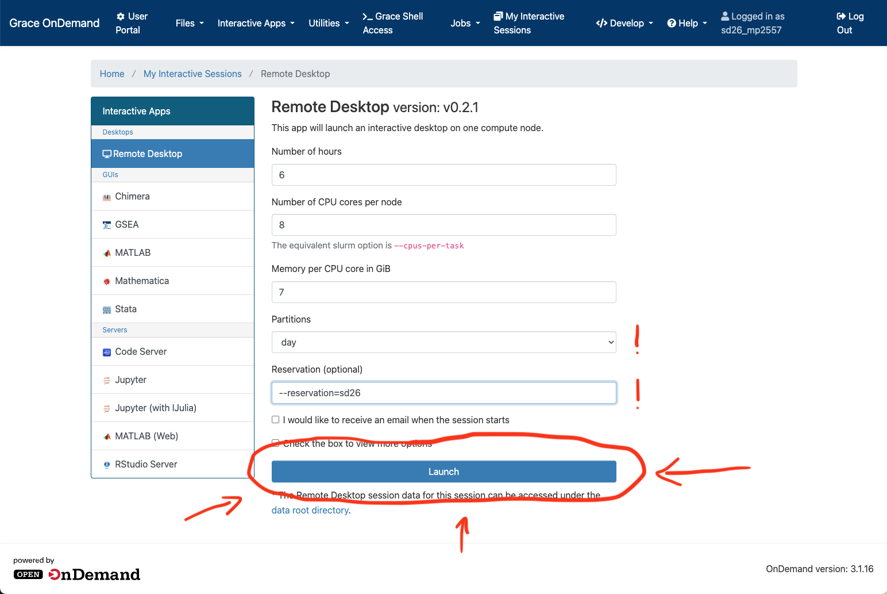
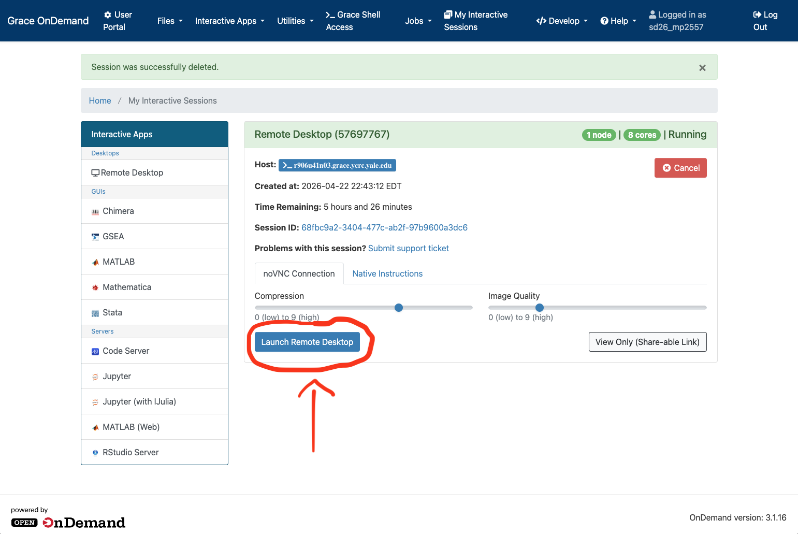
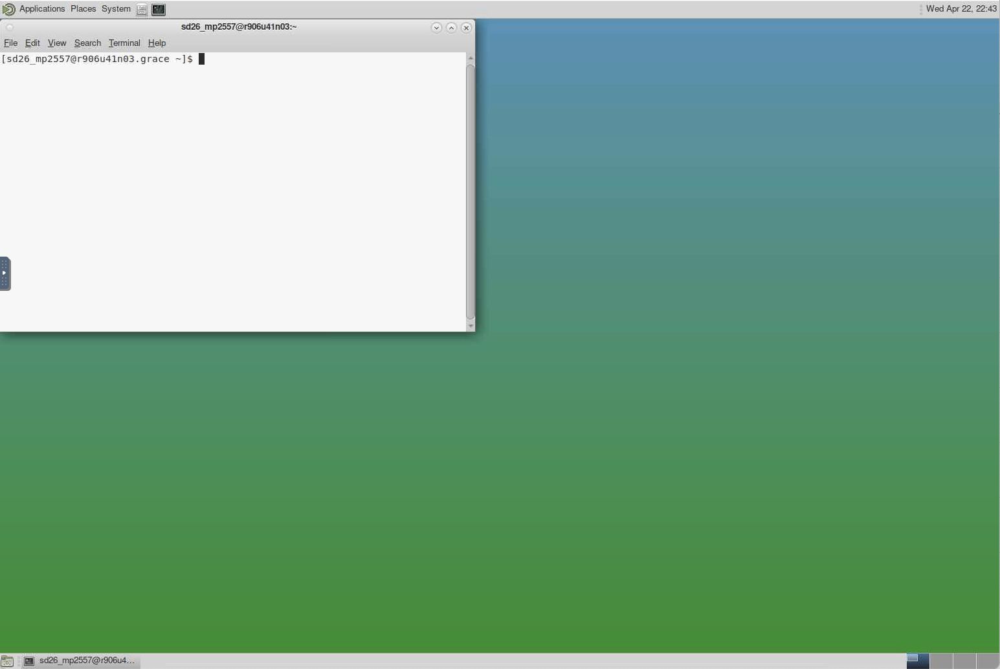
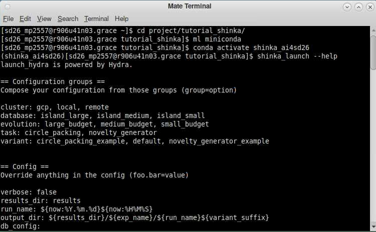
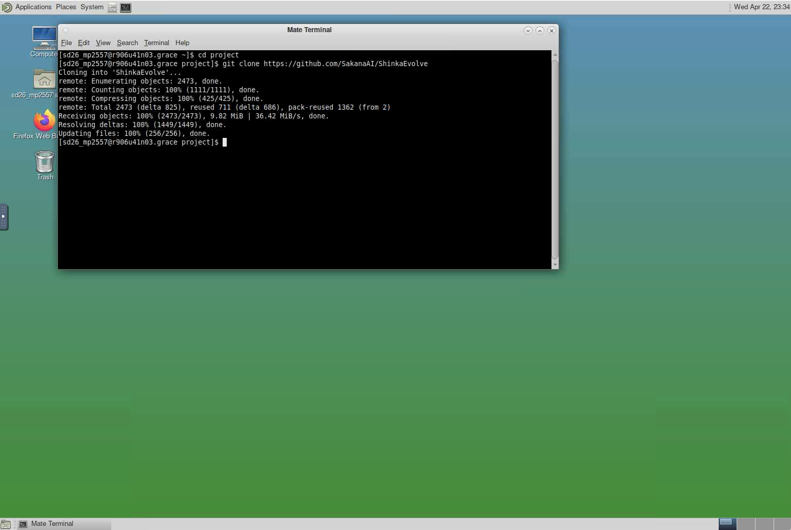
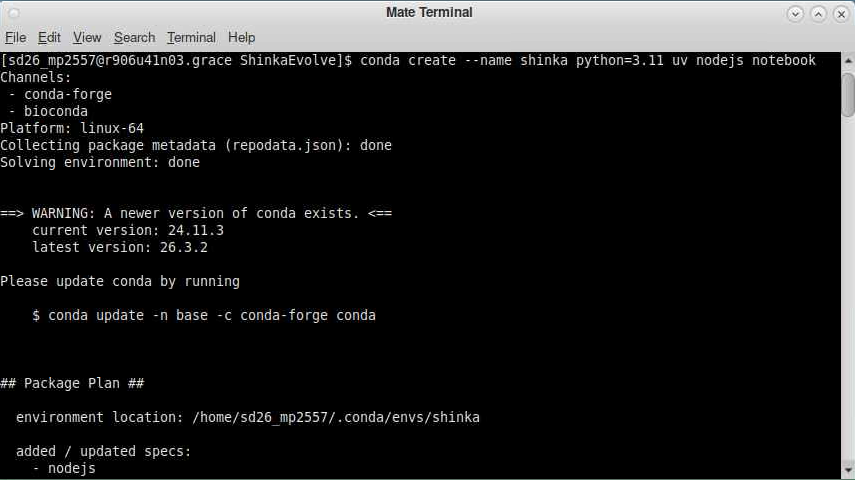
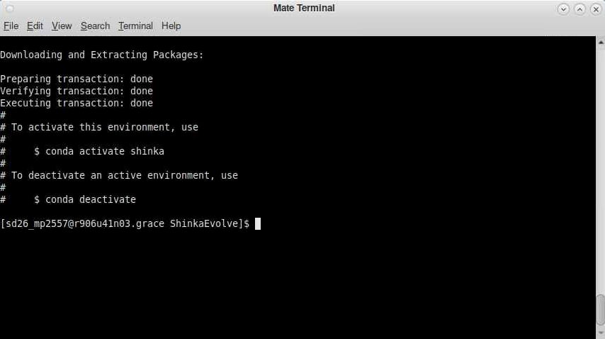

# Setting up ShinkaEvolve on Grace

This guide will discuss **how to use ShinkaEvolve** on the **Grace High-performance Computing (HPC) cluster**. The Grace HPC cluster is a shared-use computing resource managed by the **[Yale Center for Research Computing](https://research.computing.yale.edu/)** (YCRC). The cluster runs **[Redhat Linux](https://www.redhat.com/en/technologies/linux-platforms/enterprise-linux)**, and a desktop environment on the cluster can be accessed through your **web browser** using **[Open OnDemand](https://docs.ycrc.yale.edu/clusters-at-yale/access/ood/)**.

YCRC has kindly dedicated compute resources for this Hackathon. Registered attendants will have *priority access* to compute nodes on the Grace HPC cluster during the event. Each attendant will have shortened wait times when requesting nodes with resources up to 8 cores and 7 GB of memory per core on the `day` partition of Grace.

Each registered attendant will also have an account on Grace with **ShinkaEvolve pre-installed** through a Conda environment.

-   The environment will come **pre-loaded** with an **API key for [OpenRouter](https://openrouter.ai/)** so that you can get immediately get started with using ShinkaEvolve.


This tutorial is focused on **setting up your ShinkaEvolve environment on Grace**. It is split into three steps.

-   Step 1 - Logging into your Grace desktop environment.

-   Step 2 - Creating an environment on Grace where you can **run ShinkaEvolve** to **solve search problems**.

-   Step 3 - Creating an environment on Grace where you can **hack** on the **implementation of ShinkaEvolve**.

Some links that might help with this tutorial

-   [[link](https://docs.ycrc.yale.edu/clusters/grace/)] YCRC's Grace HPC cluster overview guide.

-   [[link](https://github.com/SakanaAI/ShinkaEvolve)] the official ShinkaEvolve Github repository

-   [[link](https://sakanaai.github.io/ShinkaEvolve/getting_started/)] Sakana AI's *Getting Started* guide for ShinkaEvolve.

-   [[link]](https://sakanaai.github.io/ShinkaEvolve/) ShinkaEvolve's official documentation site.

Before beginning **make sure you have the following**

-   Make sure you are either on the `YaleSecure` wifi network, or are accessing Yale's network through a VPN.

-   You will need your **Yale NetID** and **password** to access Grace.

---

## Step 1: Logging into Grace

You can use the following steps to log into your Desktop environment on Grace.

Use these steps to get started using Grace.

1.  Navigate to YCRC's **Open OnDemand**: https://sd26.ycrc.yale.edu page and make sure your user ID is *sd_netid*. Note that this is a **different from the standard ood link for Grace** and it is specific for this workshop.

    

2. Click on **Interactive Apps >  Remote Desktop** to launch a remote desktop session.

    

3.  You will be brought to a page for requesting a *compute node*. YCRC has provisioned every registered attendee with priority access to nodes on Grace.

    - Select your *Number of hours* to be `6`. Note that resources will be available until 8pm on 4/24, so request at most 20-[current time] hours.
    - Select your *Number of CPU cores per node* to be `6`
    - Select your *Memory per CPU code* to be `7`
    - Select your *Partition* to be `day` **This is important (!)**
    - Under *Reservation (optional)*, type `--reservation=sd26`. This will give priority to your request.

    

    **TODO(antaresc) - Make sure that this is the correct amount of compute provisioned to every registered attendee**

4.  Click `Launch` and wait briefly until the compute node is provisioned. Once the node is provisioned, click `Launch Remote Desktop`. *If the wait takes particularly long, please flag down an event organizer*

    

    A terminal will already be open upon starting your Desktop environment.

    

    From here you're ready to go!

---

## Step 2: Setting up ShinkaEvolve to solve search problems

Now that you're logged into Grace, you can get started with setting up an environment where you can use ShinkaEvolve to solve search problems. To begin, **create** and **navigate to a working directory** where you will be implementing your search problems

```bash
mkdir /path/to/working_directory
cd /path/to/working_directory
```

**[Conda](https://docs.conda.io/projects/conda/en/stable/index.html)** is a package and environment manager commonly used across the physical sciences when writing code for different programming tasks. YCRC staff have already created a **Conda environment** with ShinkaEvolve pre-installed. You can use this by **loading the Conda module into your Desktop environment**

```bash
module load miniconda
```

Then, **activate the `shinka_ai4sd26` environment**

```bash
conda activate shinka
```

You can test that your environment has activated properly by checking if `shinka_launch` runs as a command

```bash
shinka_launch --help
```



---

## Step 3: Hacking on the ShinkaEvolve implementation

To get started developing in the ShinkaEvolve repository, follow these steps.

1.  First, navigate to a directory which will hold the [ShinkaEvolve Github repository](https://github.com/SakanaAI/ShinkaEvolve). This tutorial will be using `~/project`

2.  Clone the repository by running the command

    ```bash
    git clone https://github.com/SakanaAI/ShinkaEvolve
    ```

    

3.  Change to the `ShinkaEvolve` directory containing your freshly cloned repository.

    ```bash
    cd ShinkaEvolve
    ```

4.  Create a **virtual environment** using Conda

    ```bash
    conda create --name shinka python=3.11 uv nodejs notebook
    ```

    Virtual environments are helpful for enforcing *isolation*, e.g. they help prevent software dependency conflicts between different coding projects.

    

    After the virtual environment has been created, you will see instructions to activate it.

    

5.  Activate your new Conda virtual environment

    ```bash
    conda activate shinka
    ```

    and install all project dependencies

    ```bash
    uv pip install -e .
    ```

6.  Create an `.env` file at the root the cloned repository. This file will contain your [OpenRouter](https://openrouter.ai/) API key.

    ```bash
    touch .env && echo 'OPENROUTER_API_KEY="<your-key-here>"' > .env
    ```

    **Having this API key is important (!)**. This key is **uniquely assigned** and is what allows ShinkaEvolve to query different Large Language Models as it executes evolutionary search for your task.

    You should have been assigned an API key for this workshop, contact the organizers if you cannot find it.

7.  Once you've added your API key, you're now ready to develop in the ShinkaEvolve repository. You can test that you've set up your environment properly by **running the repository's default evolution task**

    ```bash
    shinka_launch
    ```


## Where to go from here

You're now ready to use ShikaEvolve on Grace!

-   Read [Getting Started with Claude Code](./claude.md) to see how to setup Claude Code on Grace.

-   Read [Using ShinkaEvolve Agentically](./shinka_agentic.md) to see how to use ShinkaEvolve through Claude Code.

-   Read [Using ShinkaEvolve through Jupyter Notebooks](./shinka_via_jupyter.md) to see how to use ShinkaEvolve in a Jupyter notebook.

-   Read [Scripting with ShinkaEvolve](./shinka_via_script.md) to see how to use ShinkaEvolve using Python scripts, and on how to develop code inside the ShinkaEvolve repository.

-   Visit the notebooks in this repository to try out some working examples with ShinkaEvolve

-   Read the [Getting Started](https://sakanaai.github.io/ShinkaEvolve/getting_started/) guide to see how to build within the ShinkaEvolve repository.
