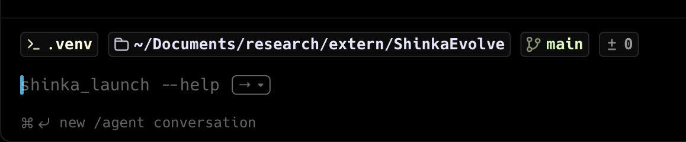
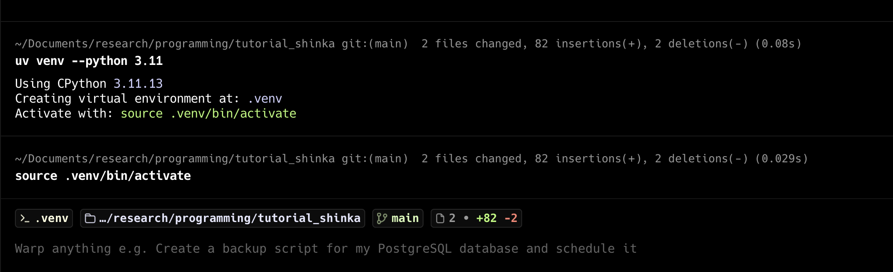
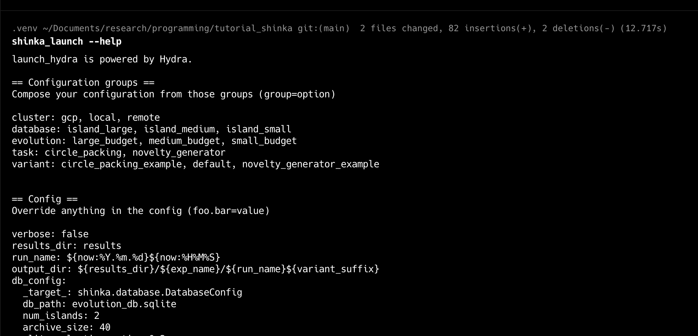
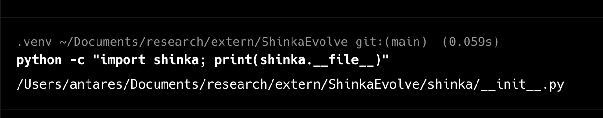

# Setting up ShinkaEvolve locally

This guide will discuss **how to use ShinkaEvolve** on your personal computer. It contains three parts:

-   Part 1 - A quick guide to Python package managers.

-   Part 2 - How to create a personal environment where you can **run ShinkaEvolve** for your own experiments.

-   Step 3 - How to create a personal environment where you can **hack** on the **implementation of ShinkaEvolve**.

Some links that might help with this tutorial

-   [[link](https://github.com/SakanaAI/ShinkaEvolve)] the official ShinkaEvolve Github repository

-   [[link](https://sakanaai.github.io/ShinkaEvolve/getting_started/)] Sakana AI's *Getting Started* guide for ShinkaEvolve.

-   [[link]](https://sakanaai.github.io/ShinkaEvolve/) ShinkaEvolve's official documentation site.

Before beginning **make sure you have the following**

-   You have `Python 3.11` and `git` installed on your computer

---

# Part 1. A quick note on Python package managers

Python has a rich ecosystem of external packages such as *ShinkaEvolve*. Python also has a number of **package managers** which helps manage these external dependencies. These tools play a number of roles two of which are

-   **(Easy Installation)** - Package managers provide tools to download, and install a large collection of external packages. This prevents the developer from having to hunt for, and follow specially curated instructions to install different binaries

-   **(Isolation)** - Package managers provide tools to ensure that one project's dependencies do not conflict with another. For example, this would prevent the case where updating one project's packages breaks code in another project.

In order to enforce isolation, package managers allow users to define *virtual environments*.

-   **Virtual environments** are isolated copies of Python with their own independent sets of installed packages. When you create a new virtual environment, it is as if you've installed Python for the first time.

Each virtual environment starts clean and is unaffected by work done in other projects.

Some common Python package managers include the following

-   `pip` - This is the default package manager that is bundeled with every installation of Python.

-   `uv` - We **recommended** use `uv` when working with ShinkaEvolve due to how fast the package manager is.

-   `Conda` - This is the standard package manager on [Grace](https://docs.ycrc.yale.edu/clusters/grace/), and other High Performance Clusters managed by the [Yale Center for Research Computing](https://research.computing.yale.edu/). It is widely used across data science, and the physical sciences.


## Using UV

If you are using **Linux / Mac**, you can **install uv** by running the following command in your terminal.

```bash
curl -LsSf https://astral.sh/uv/install.sh | sh
```

If you are using **Windows** then you can run this command in power shell

```shell
powershell -c "irm https://astral.sh/uv/install.ps1 | iex"
```

Both these commands will download and execute the installation script. Once finished, you are ready to use `uv`

When starting a new project, **create a virtual environment** by running the following command in your *working directory*

```bash
uv venv --python 3.11
```

This will create a virtual environment containing Python 3.11 named `venv`. **Activate the virtual environment** by executing its *activation script*. Run the command

```bash
source .venv/bin/activate
```

Certain terminals have a feature which denotes to the user which virtual environment they are using. Yours may look like this



Notice where it says `.venv`. To **install packages** use the following command.

```bash
uv pip install <PACKAGE NAME>
```

For example, this is how you would **install ShinkaEvolve**

```bash
uv pip install shinka-evolve
```

Certain Python projects will come with a list of external dependencies. You may find this in files that are named `pyproject.toml` or `requirements.txt`. In the directory which contains either of these metadata files, you can **install all dependencies** in one command by running

```bash
uv pip install -e .
```

The `.` is important in this command.


## Using Conda

[Conda](https://docs.conda.io/en/latest/) is the default Python package manager on Grace and other High Performance Computing clusters managed by the Yale Center for Research Computing. You will be interfacing with Conda if you use ShinkaEvolve on Grace.

Virtual environments in Conda are called **Conda environments**. To **create a new Conda environment**, run the command

```bash
conda create -n <NAME OF ENVIRONMENT>
```

You can specify the Python version and additional packages that you would like to install in the environment via

```bash
conda create -n <NAME OF ENVIRONMENT> python=<VERSION> <PACKAGES...>
```

For example, this command creates a new Conda environment named `shinka` with Jupyter notebook and uv installed.

```bash
conda create -n shinka python=3.11 notebook uv
```

During this hackathon, your account on Grace will have access to a Conda environment with `uv`, `shinka-evolve` and other helpful packages already installed. The environment is named `shinka_ai4sd26` and you can **activate it** by running the following command **in a terminal on Grace**


```bash
conda activate shinka_ai4sd26
```

# Part 2: Setting up ShinkaEvolve to solve search problems

To get started using ShinkaEvolve on your own system, navigate to your **working directory**. This will contain all code that implements the experiments you want to run with ShinkaEvolve. For this tutorial, we will be using this tutorial repository as our working environment.

```bash
cd <PATH TO...>/tutorial_shinka
```

Now, start with **creating a virtual environment** using your package manager of choice. We will use `uv`.

```bash
uv venv --python 3.11
```

This will create a virtual environment named `venv`. **Activate the virtual environment** by executing the activate script.

```bash
source .venv/bin/activate
```

Your screen might look like this now.



Finally, **install ShinkaEvolve** using pip

```bash
uv pip install shinka-evolve
```

You are now ready to go! Make sure everything is installed properly by running the following command

```bash
shinka_launch --help
```




# Part 3: Setting up ShinkaEvolve for development

Here are some instructions on how to get started with editing the implementation of ShinkaEvolve. Here, you will want to find a suitable location on your machine where you can setup a simple development environment. Once you've navigated to there, **clone the ShinkaEvolve Github repository**.

```bash
git clone https://github.com/SakanaAI/ShinkaEvolve
```

Now `change into the ShinkaEvolve directory`.

```bash
cd ShinkaEvolve
```

Once you're in the ShinkaEvolve directory, **create a virtual environment**.

```bash
uv venv --python 3.11
```

and **activate** the environment

```bash
source .venv/bin/activate
```

This is where *isolation* is helpful! You may have already installed the version of ShinkaEvolve that is a package that is *available through Python package manager indices* like that on `uv` or `pip`. So, if this package was installed *globally* on your machine, then perhaps you might edit the implementation, and hope to run ShinkaEvolve your edited version. But by default, your machine will first execute the *globally* installed one that does not have your implementation changes.

Tell your new virtual environment to *install the version that you're editing* by running this command

```
uv pip install -e .
```

Now you should be able to change the implementation and test your changes. If you want to check that you're running the version of ShinkaEvolve that is implemented in your current directory, you can run the command

```bash
python -c "import shinka; print(shinka.__file__)"
```

The output should point to `ShinkaEvolve/shinka/__init__.py`



When testing out your local implementation of ShinkaEvolve, you will want to use ShinkaEvolve through scripting. See `recipes/shinka_via_script.md` for more information.


# Where to go from here

Now that you have ShinkaEvolve set up locally on your machine consider trying out the following.

-   Check out `recipes/shinka_via_jupyter.md` to see how use ShinkaEvolve through Jupyter notebooks. This is helpful when using the tool to solve search problems in your own research.

-   Check out `recipes/shinka_via_script.md` if you want to see how to write code which programmatically uses the ShinkaEvolve python package. Try hacking on the implementation of ShinkaEvolve. Implement different sampling algorithms when using an LLM to generate a mutation, or try implementing different novelty heuristics.
