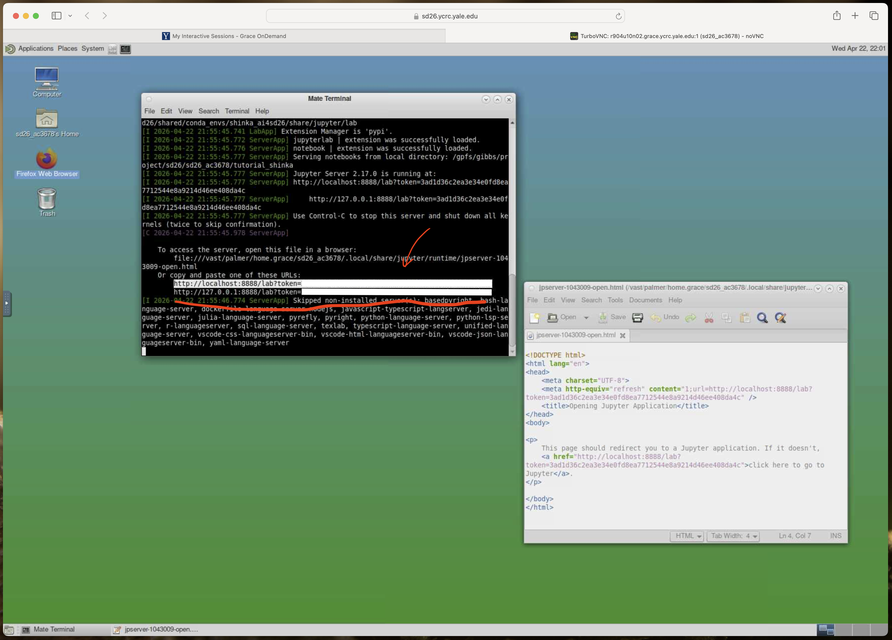
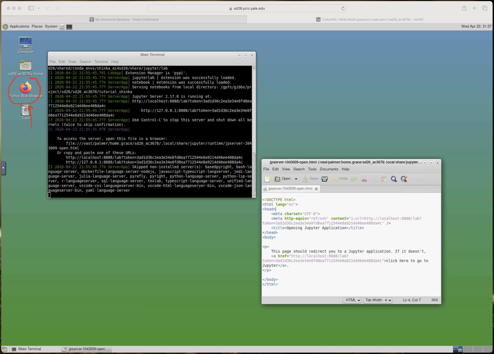
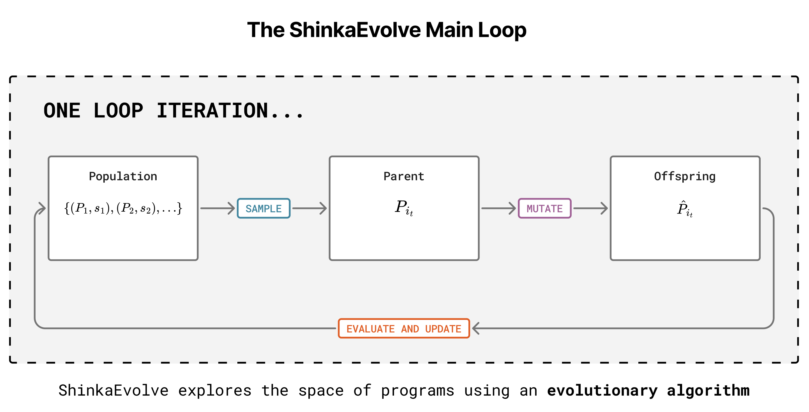
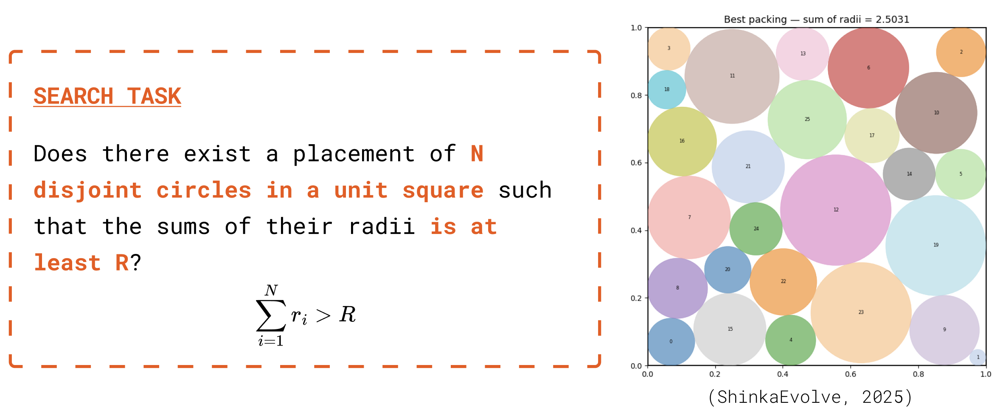
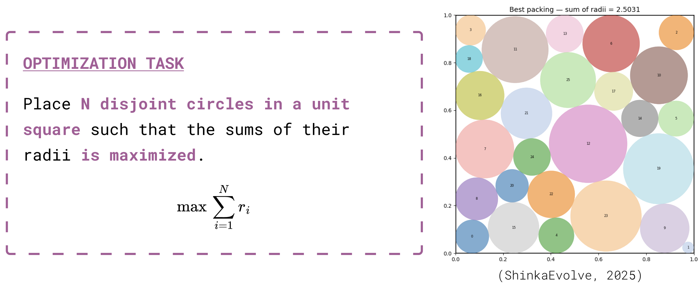
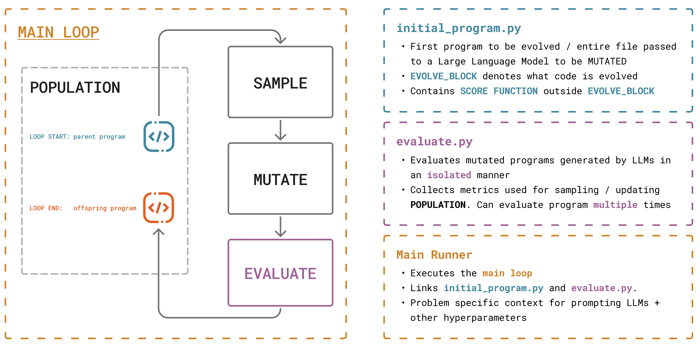
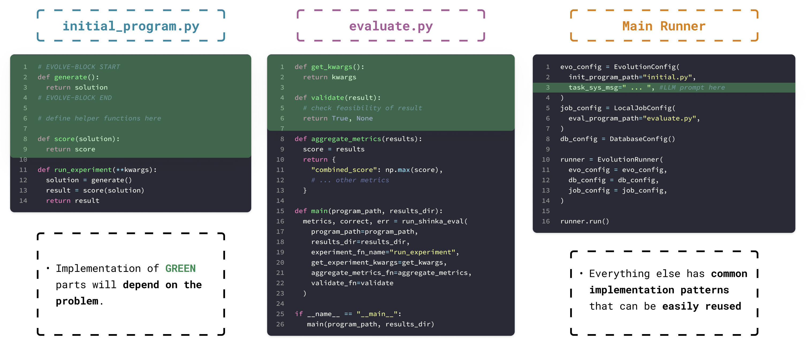
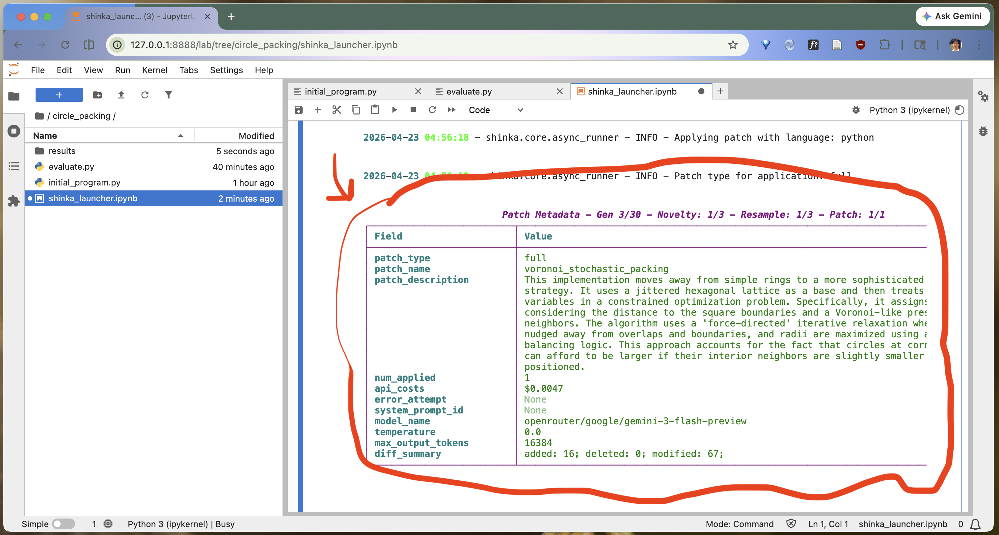

# Using ShinkaEvolve through Jupyter Notebooks

In this guide we will discuss how to use ShinkaEvolve via Jupyter notebooks. This is a simple work flow which allows you to apply ShinkaEvolve to search problems that might appear in your own research.

This guide is split into **3 parts**.

-   Part 1. - A brief overview of how to use Jupyter Lab and Jupyter notebooks.

-   Part 2. - A primer on how ShinkaEvolve works and what one needs to implement in order to use it.

-   Part 3. - A walk through of the circle packing task using JupyterLab

Here are some links which might help with this tutorial

-   [[link](https://github.com/SakanaAI/ShinkaEvolve)] the official ShinkaEvolve Github repository

-   [[link](https://sakanaai.github.io/ShinkaEvolve/getting_started/)] Sakana AI's *Getting Started* guide for ShinkaEvolve.

-   [[link]](https://docs.jupyter.org/en/latest/#what-is-a-notebook) The official documentation for Project Jupyter. See for example the *What is a notebook* section.

-   [[link]](https://jupyter.org/install) Installation instructions for JupyterLab

-   [[link]](https://jupyter-notebook.readthedocs.io/en/latest/) Official documentation for Jupyter Notebook.

-   [[link]](https://jupyterlab.readthedocs.io/en/stable/) Official documentation for Jupyterlab

Before beginning **make sure you have the following**

-   You have **already installed ShinkaEvolve** on your machine. See [Setting up ShinkaEvolve on Grace](./shinka_on_grace.md) for instructions on how to install ShinkaEvolve on Grace, and [Setting up ShinkaEvolve locally](./shinka_on_local.md) for instructions on how to install ShinkaEvolve on your local machine.

---

## Part 1. A quick guide to Jupyter Notebooks

**[Jupyter Notebooks](https://jupyter-notebook.readthedocs.io/en/latest/)** are a type of *computational notebook* which use Python as its primary programming language. These are documents which combine plaintext Markdown descriptions, Python code, and interactive data-rich visualizations. Jupyter Notebooks are modular and are easily shareable, making them a standard tool in data science.


Editing Jupyter notebooks can be done using an application called **[Jupyterlab](https://jupyterlab.readthedocs.io/en/stable/)**. Jupyterlab is a *web-based* Integrated Development Environment (IDE) which allows you to edit Jupyter notebooks, run terminals, and use custom widgets which render different visualizations that may be present in a Jupyter notebook.


This part of the tutorial will focus on accessing Jupyterlab, and opening up a Jupyter notebook within Jupyterlab.


### Installing Jupyterlab on your personal machine

For this part we will be using `uv` and working on a Mac. To **install JupyterLab**, install the `jupyterlab` package through `uv`

```bash
uv pip install jupyterlab
```

If you are using a virtual environment, you will want to run this command *after creating and activating your virtual environment*. See [Setting up ShinkaEvolve locally](./shinka_on_local.md) for more information. To start using jupyterlab, run the `jupyterlab` command.

```bash
jupyter lab
```

This will open up JupyterLab in your web browser


### Accessing Jupyter on Grace

For this event, the Yale Center for Research Computing (YCRC) will have provided special accounts for you to use on Grace, one of the High Performance Computing clusters managed by YCRC.

For more information on how to use Grace, see the guide in [Setting up ShinkaEvolve on Grace](./shinka_on_grace.md).

JupyterLab is pre-installed on your Grace account. To get started, load the `conda` module


To get started, navigate to your working directory and run activate the `shinka_ai4sd26` Conda environment

```bash
jupyter lab
```

This will pull up JupyterLab using Firefox, and you're ready to go.


##### Troubleshooting

Running `jupyter lab` on Grace might forward the contents of the JupyterLab homepage to `Pluma`, the default text editor in Grace. If this happens, you will need to open the JupyterLab homepage manually using the web browser.

Start by **finding the URL address** of the JupyterLab homepage. This will be in your terminal's output and will look like

```text
http://localhost:8888/lab?token=<SECRET TOKEN FOR THE PURPOSE OF LOGGING IN>
```

The URL contains an argument `?token=***` which is a secret token used for logging into your JupyterLab server.



Next, **open Firefox** (an icon will be on your desktop)



and **navigate to the URL** that you've copied from your terminal's output.


### Some helpful features

JupyterLab is an **Integrated Development Environment**. It has a number of features which are helpful for programming *in general*. You can **open a command line** by clicking on `+` icon in the main view, and clicking on `Terminal`


It will bring up a window which might look like this


You can **create a new Python file** by clicking on `Python File`


This will open the file in a new tab, for which you can start editing the file there.


---


## Part 2. A primer on ShinkaEvolve

Before continuing, we will provide a brief primer on the internals of ShinkaEvolve. We will be using the *Circle Packing* as a running example for this and the next part of the guide. First, let's discuss the *evolutionary algorithm* that ShinkaEvolve implements.

ShinkaEvolve runs an **evolutionary algorithm** that **evolves programs** which solve a given search problem. It is important that there is a way of **measuring** how close a program is to solving this search problem. This is done by specifying a **score function** which assigns a program to a scalar value.

Given a score function for a certain search problem, ShinkaEvolve's evolutionary algorithm can be described as follows. ShinkaEvolve maintains a **population** of **programs** solving this task paired with their **scores** $\mathcal{P} = \big\{ (P_1, s_1), (P_2, s_2), ... \big\}$. Here, the score of a program is the value output by running the score function on the program. The programs are further partitioned into **islands** $\{ C_1, C_2, ... \}$. ShinkaEvolve then iterates over the following **loop**.

1.  **SAMPLE** - Sample an island $C_{j_t}$. From that island, sample a program $P_{i_t} \in C_{j_t}$. The program $P_{i_t}$ is called the **PARENT**.

2.  **MUTATE** - Transform the **PARENT** program $P_{i_t}$ by querying a Large Language Model. ShinkaEvolve tasks an LLM to improve the **PARENT** program using a prompt which contains information such a desription of the task, the **PARENT** program $P_{i_t}$, and the score of the **PARENT**. The LLM then returns a program $\hat{P}_{i_t}$ called the **OFFSPRING**

3.  **EVALUATE & UPDATE** - ShinkaEvolve then determines whether the **OFFSPRING** $\hat{P}_{i_t}$ is added to the population. This will depend on whether $\hat{P}_{i_t}$ outputs a valid solution to the task, the **OFFSPRING**'s score, and other heuristics. If the **OFFSPRING** $\hat{P}_{i_t}$ is added to the population $\mathcal{P}$, it will be added to the same island as the **PARENT** $C_{j_{t}}$.

The following diagram summarizes the loop and its three stages.




### Modeling the circle packing problem as search and optimization

Now, let's walk through how this abstract description of ShinkaEvolve's evolutionary algorithm might look for solving Circle Packing. In **circle packing** we are asked the following **search problem**



If we want to run ShinkaEvolve's evolutionary algorithm to find a program which solves this task, then we will need a **score function**, a function which measures how close the program is to solving this task. We can do this by reframing the problem as an **optimization problem**



We can then use the **sum of the radii** $\sum_{i=1}^{N} r_{i}$ as our score function. We will have solved our search task if we can find a program whose output satisfies $\sum_{i=1}^{N} r_{i} > R$. When running ShinkaEvolve this task, its evolutionary algorithm will generate programs that output circle packings which try to maximize the sum of the radii. For this example, we will take $N = 26$


## Part 3. Using ShinkaEvolve with JupyterLab

This portion of the tutorial will walk through the **Circle Packing task** in this tutorial repository, `tutorial_shinka`. We begin by discussing which components must be implemented when using ShinkaEvolve. We then step through how this is done for the Circle Packing task. All files for circle packing can be found in `tutorial_shinka/circle_packing`.


### What absolutely must be implemented

There are **three components** which need to be implemented (see also [Evaluation Setup & Initial Solution](https://github.com/SakanaAI/ShinkaEvolve#evaluation-setup--initial-solution-) in the ShinkaEvolve documentation).


1.  **`initial_program.py`** - This is the *first program* added to the population. There are two important portions: (1) the **evolve block** which contains code that an LLM will evolve, and (2) code that exists outside the evolve block which the LLM is *not* allowed to change, but can use as context for generating mutations.

2.  **`evaluate.py`** - This file defines how to test and evaluate mutations generated by LLMs. It contains code which *validates* whether a mutation correctly solves the given task, as well as code which *computes metrics* that guide the ShinkaEvolve main loop.

3.  **The main runner** - This is the main harness which links `initial_program.py` and `evaluate.py` to the ShinkaEvolve main loop. This is code which is typically implemented in a *Jupyter Notebook*. It can also be implemented in a standalone script (see for example documentation on [CLI usage](https://sakanaai.github.io/ShinkaEvolve/cli_usage/)).

The following diagram summarizes what needs to implement



and this diagram summarizes code that might appear in each component might look like



Let's now step through the code implementing this task using Jupyter Lab


### Opening the circle packing notebook on JupyterLab

Start by opening JupyterLab at the root of the `tutorial_shinka` repository by running

```bash
jupyter lab
```

Navigate to the `circle_packing` subdirectory in the file tree on the left hand side.


Click around on the three files in this subdirectory.

**`initial_program.py`**

-   **Important (!)** - The **evolve block** is marked with two Python comments. The block must start with `# EVOLVE-BLOCK-START` and end with `# EVOLVE-BLOCK-END`.

    ```python
    # EVOLVE-BLOCK-START
    import numpy as np
    ...
    # EVOLVE-BLOCK-END
    ```

-   Inside the **evolve block** contains a basic solver for finding circle packings. The function `construct_packing()` computes the packing and returns it as a tuple of two lists `(centers, radii)`.

    ```python
    def construct_packing():
        ...
        return centers, radii
    ```

    This is also what an LLM will mutate as ShinkaEvolve is running. Subsequently generated programs will overwrite code in the evolve block with more sophisticated packing algorithms.

-   Outside the *evolve block* contains `run_packing()`. This function calls `construct_packing()` to get the packing, computes the *score function* `sum_of_radii` and then returns the packing along with its score.

    ```python
    def run_packing():
        """
        Main entrypoint called by the evaluator.

        Returns
        -------
        centers      : np.ndarray, shape (26, 2)
        radii        : np.ndarray, shape (26,)
        sum_of_radii : float
        """
        centers, radii = construct_packing()
        sum_of_radii = float(np.sum(radii))
        return centers, radii, sum_of_radii
    ```


**`evaluate.py`**

-   **Important (!)** - `evaluate.py` contains a `main` function that calls [`run_shinka_eval`](https://sakanaai.github.io/ShinkaEvolve/reference/core_api/#shinka.core.wrap_eval.run_shinka_eval). This is helper function is what runs a mutation (potentially multiple times), validates a mutation, and collects metrics.

    -   The parameter `experiment_fn_name` must be set to the name of the function which generates the solution for our task in `initial_program.py`. In this case, we have

        ```python
        metrics, correct, error_msg = run_shinka_eval(
            ...
            experiment_fn_name="run_packing",
            ...
            num_runs=1,
            ...
            validate_fn=validate_packing,
            aggregate_metrics_fn=aggregate_metrics,
        )
        ```

        The other two parameters `validate_fn` and `aggregate_metrics_fn` contain the names of functions in `evaluate.py` which (1) validate that a mutation is correct, and (2) computes metrics used to guide the ShinkaEvolve main loop. One the metrics in (2) is the score function $\sum_{i=1}^{N} r_{i}$.

        The parameter `num_runs` determines how many times a mutation is run to generate the score used by the Shinka main loop. In this case `num_runs=1`, but for programs which might use randomness, one can set `num_runs > 1` then compute a score function that is an average across all runs.

-   **IMPORTANT (!)** - `experiment_fn_name` **has to be set** to the name of the function in `initial_program.py` which returns a solution to our task. In this case `experiment_fn_name="run_packing"`

-   `validate_packing(result)` takes in the output of **one mutation run** `result` and checks if it computes a valid circle packing.

-   `aggregate_metrics(results)` takes in **a list of results** `results` generated from potentially running a mutation multiple times. Its output is a dictionary of metrics used to guide the evolutionary algorithm.

    ```python
    def aggregate_metrics(results):
        # Since we're only running the mutation once, the output of the mutation is in the
        # first index of the list.
        centers, radii, reported_sum = results[0]

        ...

        return {
            # IMPORTANT (!) - This is the value of the score function. Notice that this just
            # returns the sum of radii computed in initial_program.py
            "combined_score": reported_sum,
            # Metrics that are reported to logs and the Web UI
            "public": {...},
            # Metrics that are only used by ShinkaEvolve internals
            "private": {...},
            ...
        }
    ```

    -   **IMPORTANT (!)** - The value of the score function, the value that ShinkaEvolve generates programs to **maximize**, is returned in the `combined_score`. This is one of the most important parameters!


**`shinka_launcher.ipynb`** - This Jupyter notebook interfaces between `initial_program.py` and `evaluate.py`. The two important pieces are the following.

-   This is where we set all the hyperparameters that we need to run ShinkaEvolve. See **Part 2** of the notebook `shinka_launcher.ipynb` for a more detailed guide to these parameters.

-   This is also where we **initialize** and **execute** ShinkaEvolve for our task. This code can be found in **Part 3** of the notebook `shinka_launcher.ipynb`. To initialize ShinkaEvolve, use create an instance of the `ShinkaEvolveRunner` object [docs](https://sakanaai.github.io/ShinkaEvolve/reference/core_api/#shinka.core.async_runner.ShinkaEvolveRunner)

    ```python
    runner = ShinkaEvolveRunner(
        # These are objects which define hyperparameters
        evo_config=evo_config,
        job_config=job_config,
        db_config=db_config,
        # For debugging purposes
        verbose=True,
    )
    ```

    The evolution algorithm in ShinkaEvolve can be run **asynchronously**. The following line of Python executes a run

    ```python
    await runner.run_async()
    ```


### Running the circle packing notebook

Now step through the notebook in `circle_packing/shinka_launcher.ipynb`. Running the cells up to Part 3. will create a run of ShinkaEvolve. We know that things are properly running when you see the fish logo


And that you've seen one correct mutation created. This can be seen by looking for a table in the logs like so



Here are some interesting details that you can find in the logs

-   `patch_description` - This contains a natural language description of the mutation generated by the LLM

-   `model_name` - The LLM model used to generate the mutation

-   `api_costs` - How much it cost to generate the mutation.


## Where to go from here

Now that we've stepped through running a evolution task in ShinkaEvolve, we're ready to use ShinkaEvolve for our own search problem, and try out more advanced features.

-   Try running ShinkaEvolve for your own task.

-   Consider reading more about ShinkaEvolve's use of multi-armed bandits for selecting which LLM to sample a mutation from [[link](https://sakanaai.github.io/ShinkaEvolve/bandit_selection/)]

-   Consider reading more about how concurrency is handled in ShinkaEvolve [[link](https://sakanaai.github.io/ShinkaEvolve/async_evolution/)].

