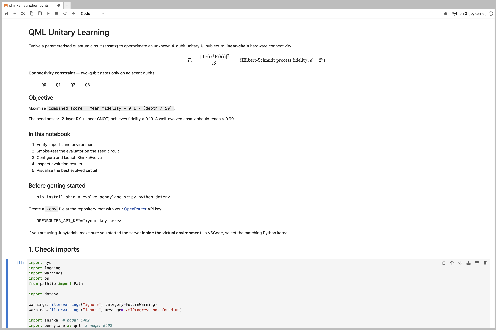
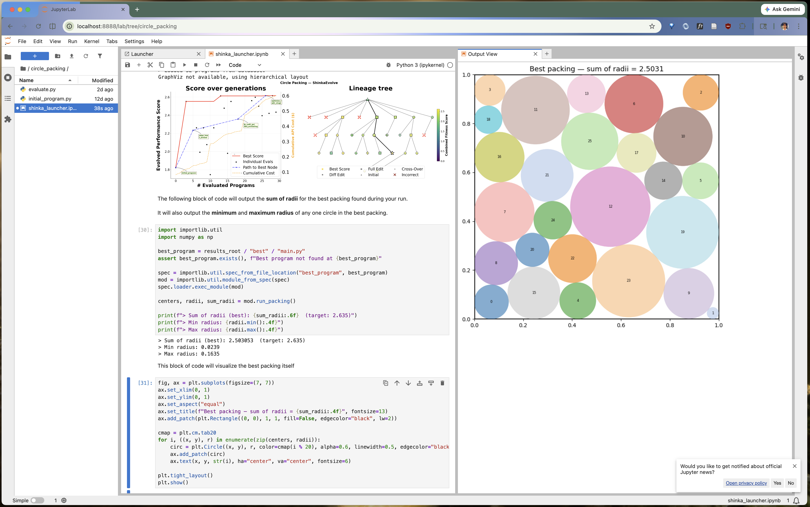
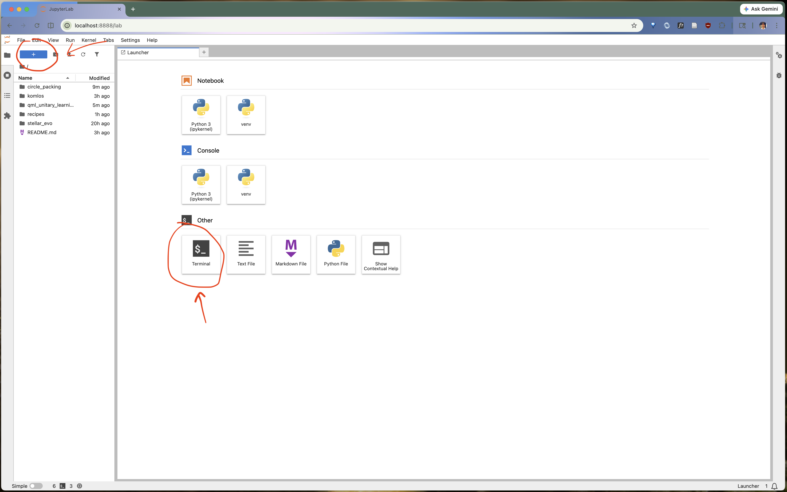
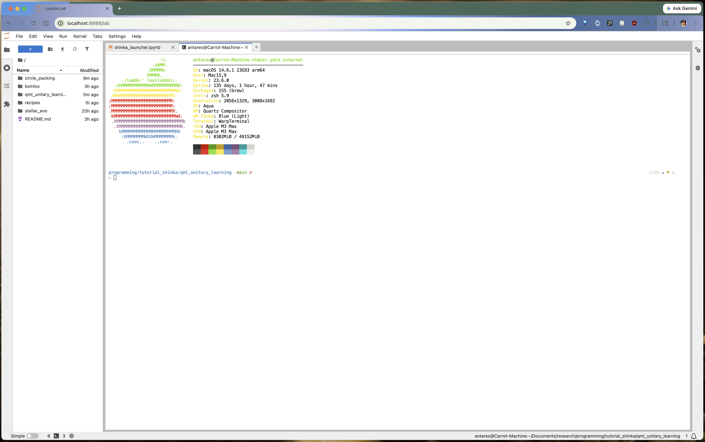
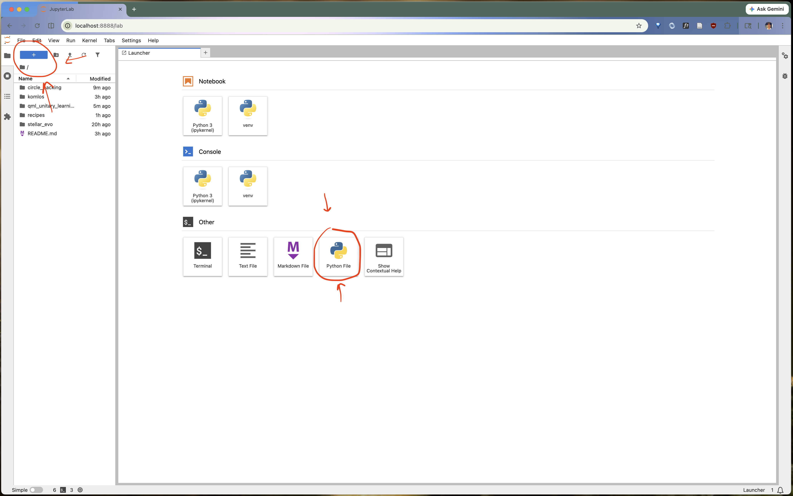

# Using ShinkaEvolve through Jupyter Notebooks

In this guide we will discuss how to use ShinkaEvolve via Jupyter notebooks. This is a simple work flow which allows you to apply ShinkaEvolve to search problems that might appear in your own research.

This guide is split into **2 parts**.

-   Part 1. - A brief overview of Jupyter Lab and Jupyter notebooks.

-   Part 2. - How to use ShinkaEvolve via Jupyter notebooks.

Here are some links which might help with this tutorial

-   [[link](https://github.com/SakanaAI/ShinkaEvolve)] the official ShinkaEvolve Github repository

-   [[link](https://sakanaai.github.io/ShinkaEvolve/getting_started/)] Sakana AI's *Getting Started* guide for ShinkaEvolve.

-   [[link]](https://docs.jupyter.org/en/latest/#what-is-a-notebook) The official documentation for Project Jupyter. See for example the *What is a notebook* section.

-   [[link]](https://jupyter.org/install) Installation instructions for JupyterLab

-   [[link]](https://jupyter-notebook.readthedocs.io/en/latest/) Official documentation for Jupyter Notebook.

-   [[link]](https://jupyterlab.readthedocs.io/en/stable/) Official documentation for Jupyterlab

Before beginning **make sure you have the following**

-   You have **already installed ShinkaEvolve** on your machine. See `recipes/shinka_on_grace.md` for instructions on how to install ShinkaEvolve on Grace, and `recipes/shinka_on_local.md` for instructions on how to install ShinkaEvolve on your local machine.


# Part 1. A quick guide to Jupyter Notebooks

**[Jupyter Notebooks](https://jupyter-notebook.readthedocs.io/en/latest/)** are a type of *computational notebook* which use Python as its primary programming language. These are documents which combine plaintext Markdown descriptions, Python code, and interactive data-rich visualizations. Jupyter Notebooks are modular and are easily shareable, making them a standard tool in data science.



Editing Jupyter notebooks can be done using an application called **[Jupyterlab](https://jupyterlab.readthedocs.io/en/stable/)**. Jupyterlab is a *web-based* Integrated Development Environment (IDE) which allows you to edit Jupyter notebooks, run terminals, and use custom widgets which render different visualizations that may be present in a Jupyter notebook.



This part of the tutorial will focus on accessing Jupyterlab, and opening up a Jupyter notebook within Jupyterlab.


## Installing Jupyterlab on your personal machine

For this part we will be using `uv` and working on a Mac. To **install JupyterLab**, install the `jupyterlab` package through `uv`

```bash
uv pip install jupyterlab
```

If you are using a virtual environment, you will want to run this command *after creating and activating your virtual environment*. See `recipes/shinka_on_local.md` for more information. To start using jupyterlab, run the `jupyterlab` command.

```bash
jupyter lab
```

This will open up JupyterLab in your web browser


## Accessing Jupyter on Grace

For this event, the Yale Center for Research Computing (YCRC) will have provided special accounts for you to use on Grace, one of the High Performance Computing clusters managed by YCRC.

For more information on how to use Grace, see the guide in `recipes/shinka_on_grace.md`.


## Some helpful features

JupyterLab is an **Integrated Development Environment**. It has a number of features which are helpful for programming *in general*. You can **open a command line** by clicking on `+` icon in the main view, and clicking on `Terminal`



It will bring up a window which might look like this



You can **create a new Python file** by clicking on `Python File`



This will open the file in a new tab, for which you can start editing the file there.


# Part 2. Using ShinkaEvolve with Jupyter notebooks

In this part of the tutorial, we will discuss how to use ShinkaEvolve with Jupyter notebooks to define our own evolution task.
